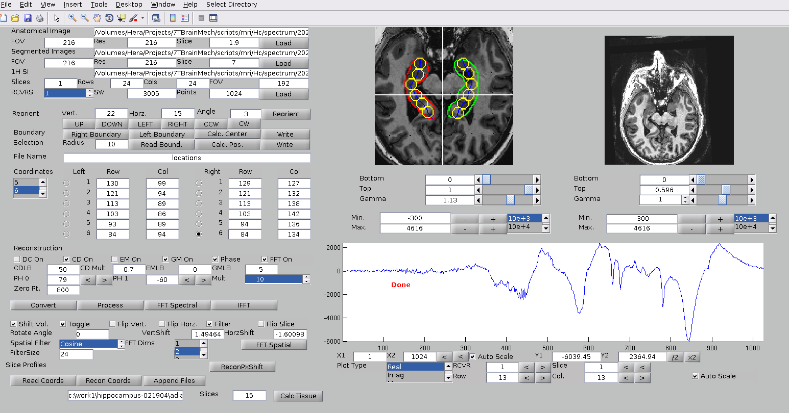
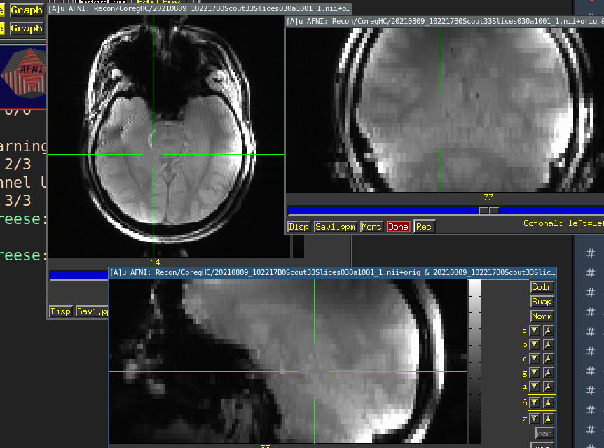
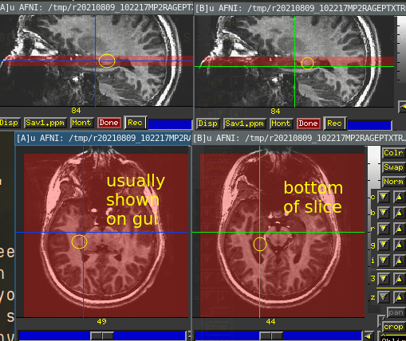
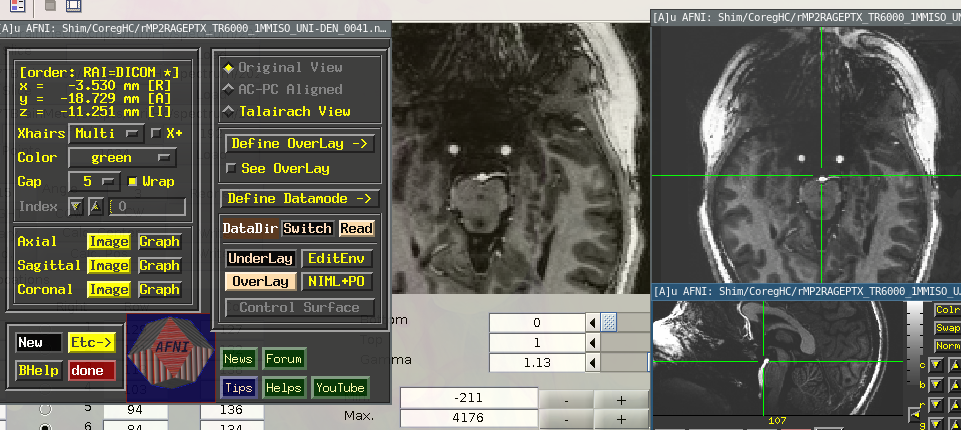
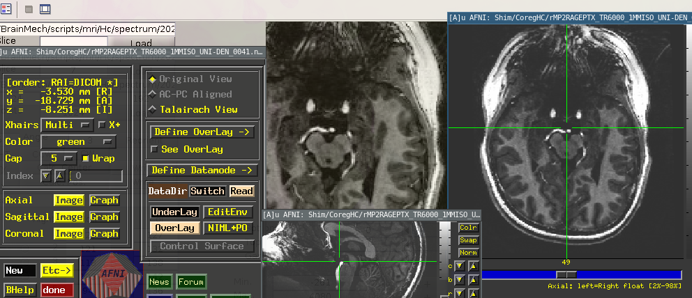
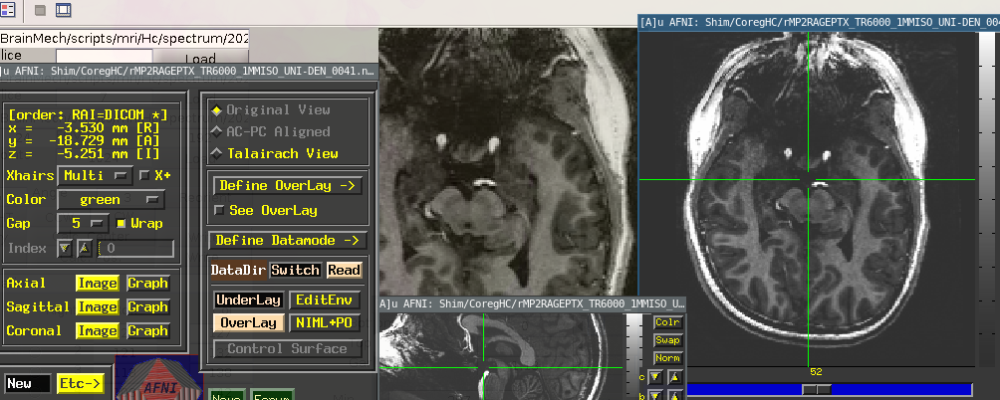

# Hc MRSI

## slice position issue
At scan time, an Hc scout is positioned to center the Hc using the T1 as reference. But the T1 was likely collected an hour before, and the scout does not have great GM contrast to confirm HC coverage. As a result, many MRSI MC acquisions do not have ideal HC coverage/positioning. This is obvious when the T1 is coregistered to the scout. 

### Using alternative slice for guidence
The middle slice of that anat in scout space is the ideal and  defaults reference for drawing hippocampal ROIs.

#### Providing "top" and "bottom"
(20221019) adding 3mm (1mm slices) to either side of middle as "top3.mat" and "bottom3.mat" using
`mri/Hc/01.2_add_top_bottom_slice.bash`

