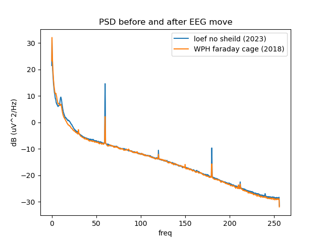

# Move to Loeffler
Mar-May 2022 move from faraday cage at WPH to unsheilded Loeffler exam room.

# Merge 7T EEG 
Also see https://lncd.pitt.edu/wiki/doku.php?id=grants:7t:merge7teeg

Merge 7T EEG combines all EEG data from the 7T grant on a per channel level. 
Thus far it is incorporating the spectral event data, FOOOF data, and SNR. 
Those files can be found in the following locations: 
 * /Volumes/Hera/Projects/7TBrainMech/scripts/eeg/Shane/Results/Spectral_Analysis/Spectral_events_analysis/allChannels_averagedOverTrials.csv
 * /Volumes/Hera/Projects/7TBrainMech/scripts/eeg/Shane/Results/FOOOF/allSubjectsAllChannelsFooofMeasures_20230911.csv
 * /Volumes/Hera/Projects/7TBrainMech/scripts/eeg/Shane/Results/SNR/allSubjectsSNR.csv

The code to combine all the files is merge7TEEG.R

Information about each task: 
 * Spectral Events
    * Run on the delay and fixation epochs from the MGS task 
    * Currently only includes visit no 1
 * FOOOF 
    * Run during resting state
    * Has a eyes open and eyes closed condition
 * SNR
    * Run during the auditory steady state task during the 40Hz condition 
  
 

# Matlab toolboxes
## fieldtrip
see 
 * ftp://ftp.fieldtriptoolbox.org/pub/fieldtrip/
 * http://www.fieldtriptoolbox.org/getting_started/bdf

## eeg lab
in toolboxes subdirectory
  * [https://sccn.ucsd.edu/wiki/EEGLAB_revision_history](wiki) 
  * [http://sccn.ucsd.edu/eeglab/currentversion/eeglab_current.zip](current release) 
### biosig
 * https://sourceforge.net/projects/biosig/files/BioSig%20for%20Octave%20and%20Matlab/biosig4octmat-3.5.0.tar.gz/download
 * manually install from eeglab: File -> Manage EEGLAB extentions -> import -> first checkbox
### PREP
  * https://github.com/VisLab/EEG-Clean-Tools.git
  extract 'https://github.com/VisLab/EEG-Clean-Tools/blob/master/EEGLABPlugin/PrepPipeline0.55.3.zip?raw=true' to eeglab/plugin
### SASICA
  * https://github.com/dnacombo/SASICA
